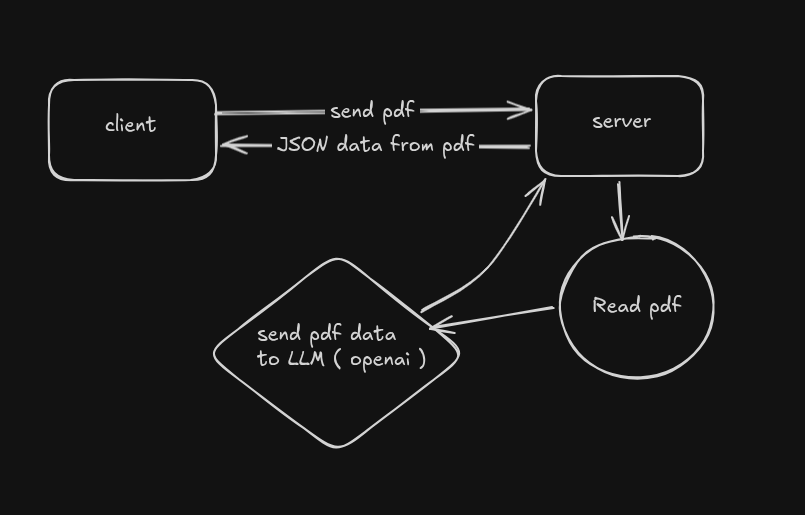

# 📄 PDF to JSON Processor

A full-stack application that extracts text from PDF files, processes them using OpenAI's LLM, and returns structured JSON data to the UI.

---

## 🛠️ Getting Started

### Prerequisites

- **Node.js** (v22 or higher)

### 1. Install Dependencies

#### Frontend

```bash
cd client && npm install
```

#### Backend

```bash
cd server && npm install
```

# 2. Run the Application

You need start both the frontend and backend in different terminals from the root directory:

## Frontend

```Bash
npm run dev
```

## Backend

```Bash
npm run dev
```

# 🔄 System Flow
The application follows a linear processing pipeline:

- Upload: Client sends the PDF file to the backend.

- Parsing: Server parses the raw PDF text.

- Chunking: Text is broken into smaller, manageable chunks for the LLM.

- Processing: Chunks are sent to OpenAI for analysis.

- Finalization: Responses are aggregated into a single JSON object and sent back to the UI.



